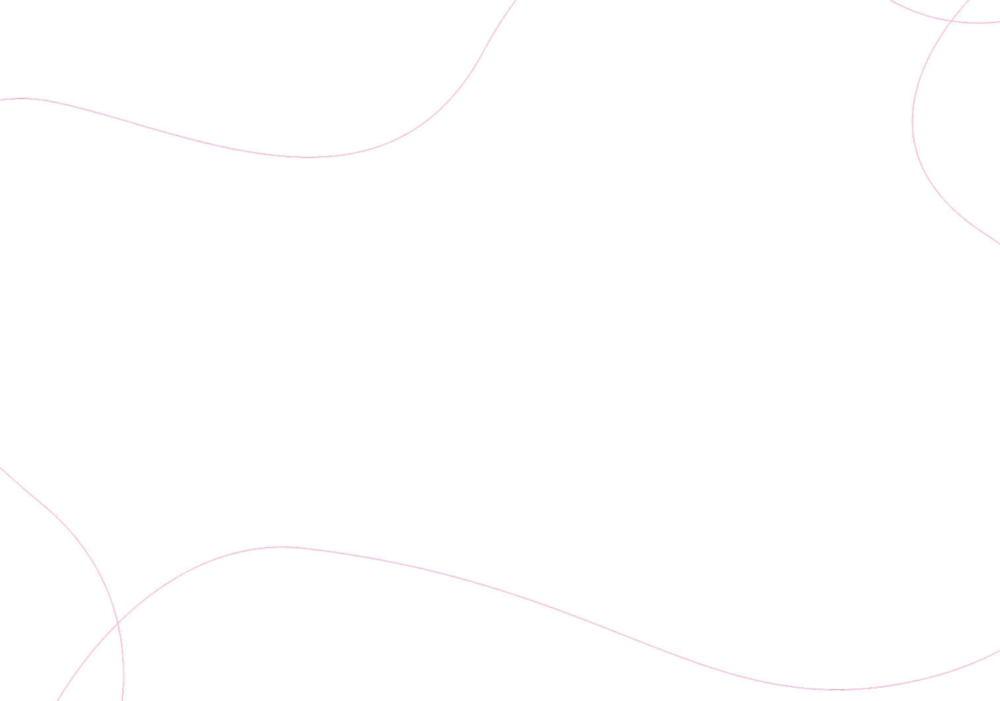

# 🍔 Project 2: Food Banner

A visually rich and responsive food banner webpage built with pure HTML and CSS.
Designed to showcase a food delivery platform with floating food imagery and key stats.

---

## 🌐 Live Demo

[View Project](https://html-css-project-2026.vercel.app/project-2/index.html)

---

## 📸 Preview



---

## ✨ Features

- 🍕 Floating food images (burger, pizza, momo, tomato, leaf)
- 📊 Info section with key platform statistics (restaurants, cities, orders)
- 📱 Fully responsive design (mobile, tablet, laptop, desktop)
- 🎨 Clean and modern UI with glassmorphism info card
- 🔤 Google Fonts (Inter) integration
- 💡 CSS Flexbox for layout management

---

## 🛠️ Tech Stack

| Technology | Usage |
|------------|-------|
| HTML5 | Page structure and semantic markup |
| CSS3 | Styling, layout and responsive design |
| Google Fonts | Inter font family |
| Flexbox | Layout management |
| Media Queries | Responsive breakpoints |

---

## 📐 Responsive Breakpoints

| Device | Breakpoint | Changes |
|--------|------------|---------|
| 💻 Desktop | > 1024px | Full layout with floating food images |
| 📟 Laptop | ≤ 1024px | Slightly reduced font sizes |
| 📱 Tablet | ≤ 768px | Hidden food images, stacked info section |
| 📲 Mobile | ≤ 480px | Compact font sizes and padding |

---

## 📁 Project Structure

---

## 🚀 How to Run Locally

1. Clone the repository
```bash
git clone https://github.com/anshuopinion/HTML-CSS-Project-2026.git
```

2. Navigate to project-2
```bash
cd HTML-CSS-Project-2026/project-2
```

3. Open `index.html` directly in your browser

OR use **Live Server** in VS Code:
- Install Live Server extension
- Right click `index.html`
- Click **"Open with Live Server"**

---

## 👩‍💻 Contribution

Responsive design and documentation added by [Aditi Patil](https://github.com/aditip01-cloud)
